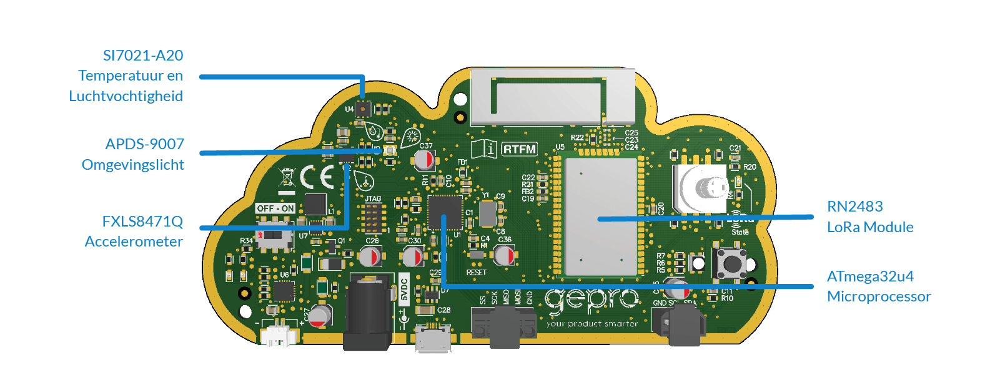

# KISS LoRa

This repository includes example software to be used with the KISS LoRa gadget from the E&A fair.

## Prerequisites

### Download this repository

Download the contents of this repository to your computer by clicking [here](archive/master.zip) or by going to **Clone or download->Download ZIP**. On your computer unzip the downloaded file by following the correct procedure for your operating system.

### Arduino IDE

Download the latest version of the Arduino IDE from [https://www.arduino.cc/en/Main/Software](https://www.arduino.cc/en/Main/Software).

> If your Arduino IDE's interface language is not English, you can change it using the following steps: 
> Dutch: **Bestand->Voorkeuren->Taal voor editor->Engels(Engels)**, hierna Arduino IDE opnieuw opstarten.

Go to **File->Preferences** on the Settings tab, next to **Show verbose output during:**, make sure the checkbox next to **upload** is selected.

### SparkFun AVR boards

In the Arduino IDE go to **File->Preferences->Additional Boards Manager URLs** and add:
`https://raw.githubusercontent.com/sparkfun/Arduino_Boards/master/IDE_Board_Manager/package_sparkfun_index.json`

Go to **Tools->Board->Boards Manager**, search for **SparkFun AVR Boards** and click on **install**.

Go to **Tools->Board** and select **SparkFun Pro Micro**.

Go to **Tools->Processor** and select **ATmega32U4 (3.3V, 8MHz)**.

### The Things Network and SoftPWM libraries

Go to **Sketch->Include Library->Manage Libraries**.

Search for **TheThingsNetwork** and click on **install**.

Search for **SoftPWM** and click on **install**.

## Uploading Firmware

> The serial monitor must be closed before uploading code to the device.

1. Switch the KISS LoRa device off.
2. Plug it into your computer using a micro USB cable.
3. In the Arduino IDE make sure the correct **Tools->Board** (SparkFun Pro Micro) and **Tools->Processor** (ATmega 32U4, 8MHz) are selected.
4. Switch the device on and make sure the correct **Tools->Port** is selected.
5. Switch the device off again.
6. Press and hold the **Push Button** on the kiss device.
6. In the Arduino IDE, choose **Sketch->Upload**.
7. As soon as you see `PORTS {} / {} => {}` printed in the output window turn KISSLoRa on.
8. When the upload process continue past showing `PORTS {} / {} => {}`, you can release the push button.

### USB Troubleshooting

It is common to have problems while trying to program Arduino devices, including the KISS LoRa device. In case you experience some issues, a simple Google search will most likely help to find a solution. Some common problems and fixes are listed here:

If you are using Linux, [read this](http://www.arduino.org/learning/getting-started/arduino-ide-on-linux-based-os).

If you are using MAC OS, [read this](https://learn.sparkfun.com/tutorials/how-to-install-ftdi-drivers/all#yosemite).

## [Original firmware](KISSLoRa-demo_app)

In the directory **KISSLoRa-demo_app** you will find the original firmware that was on the KISS LoRa device when you received it. If you ever want to flash this firmware back onto the device, have a look at the [README.md in this directory](KISSLoRa-demo_app/README.md).

## [Bootloader](Bootloader)

In the Bootloader directory you will find the hex file for the bootloader that runs on your KISS LoRa device. In the most cases you will never need this, but if you manage to brick your device, this will be useful to recover.

## [Schematics](Schematics)

The Schematics directory contains the electronic design of the board. It specifically shows how everything is connected. This is useful to have when writing firmware for the KISS LoRa device, to know on which pins the sensors are connected.

## [Examples](Examples)

In the Examples directory you will find example firmware files to read the sensors on the board. Have a look at the README in each subdirectory to see an explanation of each example.
